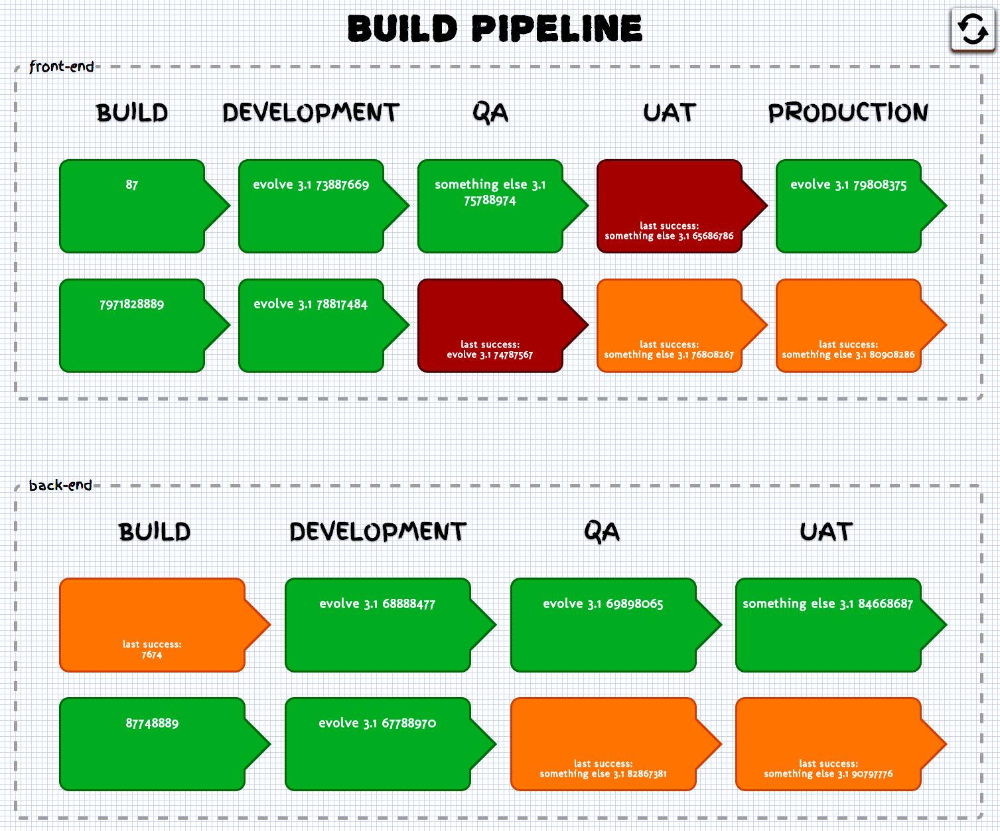

# information-radiator 
[](http://travis-ci.org/jamesdbloom/information-radiator) [](https://david-dm.org/jamesdbloom/information-radiator) [](https://david-dm.org/jamesdbloom/information-radiator#info=devDependencies) [](https://codeclimate.com/github/jamesdbloom/information-radiator) [](https://bitdeli.com/free "Bitdeli Badge") [](https://waffle.io/jamesdbloom/information-radiator)

Information radiator to clearly visualize continuous delivery pipelines

## Getting Started
Install the module with: `npm install information-radiator`

```javascript
var information_radiator = require('information-radiator');
information_radiator.awesome(); // "awesome"
```
### Overview

This module can be used to create an information radiator to clearly visualize your continuous delivery pipelines.  A typical screen might look as follows:



All aspects of this screen are configurable.  The configuration used to build this screen is as follows:

```javascript
require('information-radiator').run({
    pollPeriod: 60,
    refresh: true,
    title: "Build Pipeline",
    groups: [
        {
            name: "front-end",
            headers: ['build', 'development', 'qa', 'uat', 'production'],
            pipelines: [
                {
                    stages: [
                        {
                            url: 'http://jenkins.jamesdbloom.com/job/mockserver/lastSuccessfulBuild/api/json',
                            path: 'number',
                            link: 'http://jenkins.jamesdbloom.com/job/mockserver/lastSuccessfulBuild',
                            condition: {
                                path: 'result',
                                value: 'SUCCESS'
                            }
                        },
                        {
                            url: 'http://dev.jamesdbloom.com/info.json?json',
                            expression: '${Application.Project-Artifact-Id} ${Application.Project-Version} ${Application.Jenkins-Build-Number}',
                            condition: {
                                expression: '${Application.Project-Artifact-Id}',
                                value: 'evolve'
                            },
                            link: 'http://dev.jamesdbloom.com'
                        },
                        {
                            url: 'http://qa.jamesdbloom.com/info.json?json',
                            expression: '${Application.Project-Artifact-Id} ${Application.Project-Version} ${Application.Jenkins-Build-Number}',
                            link: 'http://qa.jamesdbloom.com'
                        },
                        {
                            url: 'http://uat.jamesdbloom.com/info.json?json',
                            expression: '${Application.Project-Artifact-Id} ${Application.Project-Version} ${Application.Jenkins-Build-Number}',
                            link: 'http://uat.jamesdbloom.com/info.json?json'
                        },
                        {
                            url: 'http://prod.jamesdbloom.com/info.json?json',
                            expression: '${Application.Project-Artifact-Id} ${Application.Project-Version} ${Application.Jenkins-Build-Number}',
                            link: 'http://prod.jamesdbloom.com/info.json?json'
                        }
                    ]
                },
                {
                    stages: [
                        {
                            url: 'http://jenkins.jamesdbloom.com/job/mockserver/lastSuccessfulBuild/api/json',
                            path: 'number',
                            link: 'http://jenkins.jamesdbloom.com/job/mockserver/lastSuccessfulBuild',
                            condition: {
                                path: 'result',
                                value: 'SUCCESS'
                            }
                        },
                        {
                            url: 'http://dev.jamesdbloom.com/info.json?json',
                            expression: '${Application.Project-Artifact-Id} ${Application.Project-Version} ${Application.Jenkins-Build-Number}',
                            condition: {
                                expression: '${Application.Project-Artifact-Id}',
                                value: 'evolve'
                            }
                        },
                        {
                            url: 'http://qa.jamesdbloom.com/info.json?json',
                            expression: '${Application.Project-Artifact-Id} ${Application.Project-Version} ${Application.Jenkins-Build-Number}'
                        },
                        {
                            url: 'http://uat.jamesdbloom.com/info.json?json',
                            expression: '${Application.Project-Artifact-Id} ${Application.Project-Version} ${Application.Jenkins-Build-Number}'
                        },
                        {
                            url: 'http://prod.jamesdbloom.com/info.json?json',
                            expression: '${Application.Project-Artifact-Id} ${Application.Project-Version} ${Application.Jenkins-Build-Number}'
                        }
                    ]
                }
            ]
        },
        {
            name: "back-end",
            headers: ['build', 'development', 'qa', 'uat'],
            pipelines: [
                {
                    stages: [
                        {
                            url: 'http://jenkins.jamesdbloom.com/job/mockserver/lastSuccessfulBuild/api/json',
                            path: 'number',
                            condition: {
                                path: 'result',
                                value: 'SUCCESS'
                            }
                        },
                        {
                            url: 'http://dev.jamesdbloom.com/info.json?json',
                            expression: '${Application.Project-Artifact-Id} ${Application.Project-Version} ${Application.Jenkins-Build-Number}',
                            condition: {
                                expression: '${Application.Project-Artifact-Id}',
                                value: 'evolve'
                            }
                        },
                        {
                            url: 'http://qa.jamesdbloom.com/info.json?json',
                            expression: '${Application.Project-Artifact-Id} ${Application.Project-Version} ${Application.Jenkins-Build-Number}'
                        },
                        {
                            url: 'http://uat.jamesdbloom.com/info.json?json',
                            expression: '${Application.Project-Artifact-Id} ${Application.Project-Version} ${Application.Jenkins-Build-Number}'
                        }
                    ]
                },
                {
                    stages: [
                        {
                            url: 'http://jenkins.jamesdbloom.com/job/mockserver/lastSuccessfulBuild/api/json',
                            path: 'number',
                            condition: {
                                path: 'result',
                                value: 'SUCCESS'
                            }
                        },
                        {
                            url: 'http://dev.jamesdbloom.com/info.json?json',
                            expression: '${Application.Project-Artifact-Id} ${Application.Project-Version} ${Application.Jenkins-Build-Number}',
                            condition: {
                                expression: '${Application.Project-Artifact-Id}',
                                value: 'evolve'
                            }
                        },
                        {
                            url: 'http://qa.jamesdbloom.com/info.json?json',
                            expression: '${Application.Project-Artifact-Id} ${Application.Project-Version} ${Application.Jenkins-Build-Number}'
                        },
                        {
                            url: 'http://uat.jamesdbloom.com/info.json?json',
                            expression: '${Application.Project-Artifact-Id} ${Application.Project-Version} ${Application.Jenkins-Build-Number}'
                        }
                    ]
                }
            ]
        }
    ]
});
```

### Options

```javascript
The basic structure of the configuration is as follows:

{
    pollPeriod: 10, // how often in seconds should stages be polled
    refresh: true, // should refresh button be shown
    title: "Main Page Title",
    groups: [
        {
            name: "pipeline group name",
            headers: ['stage one header', 'stage two header', ...],
            pipelines: [
                {
                    stages: [
                        {
                            url: 'http://127.0.0.1:9090/example.json', // url to fetch json from
                            path: '...', // simple field to read from json
                            link: 'http://127.0.0.1:9090' // optional - causes browser to navigate to this URL when the stage is clicked
                        },
                        {
                            url: 'http://127.0.0.1:9090/info?json', // url to fetch json from
                            expression: '${...} ${...}', // complex expression to read from json
                            condition: {  // additional condition to trigger success or failure state
                                expression: '${...} ${...}',  // complex expression (for simple field access use \'path\' instead)
                                value: '...' // value to match
                            }
                        },
                        ...
                    ]
                },
                ... // another pipeline with an identical lists of stages (they share the same set of headers)
            ]
        },
        ... // another pipeline group with a new type of pipeline (it has a different set of stages and headers)
    ]
}
```

#### pollPeriod
Type: `Integer`
Default value: `5`

This value specifies how often the stages should be polled to retrieve there status.

#### refresh
Type: `Boolean`
Default value: `false`

This value specifies whether the refresh button should appear in the top left hand corner.

#### title
Type: `String`
Default value: ``

This value specifies the main title that appears at the top of the page.  If not value is provided no title will appear at the top of the page.

#### groups
Type: `Array`
Default value: `[]`

This value specifies the list of pipeline groups to display.

#### groups[i].name
Type: `String`
Default value: ``

This value specifies the name of the pipeline group that will appear in the border around the pipeline group.

#### groups[i].headers
Type: `Array`
Default value: ``

This value specifies the list of stage names that appear in the header row for a pipeline group.

#### groups[i].pipelines
Type: `Array`
Default value: ``

This value specifies the list of pipelines, each with there own set of stages (that should match the list of headers for the same pipeline group).

#### groups[i].pipelines[i].stages
Type: `Array`
Default value: ``

This value specifies the list of stages within a given pipeline.

#### groups[i].pipelines[i].stages[i].url
Type: `String`
Default value: ``

This value specifies the url to fetch JSON data from.

#### groups[i].pipelines[i].stages[i].path
Type: `String`
Default value: ``

This value specifies a simple field path to retrieve a value from a JSON response.  The retrieved value is then displayed in the box representing the stage.  When a stage fails then the previous successful value is also displayed in the box.  Either path or expression can be used to retrieve a the value that is displayed, however if both are specified path will take precedence and expression will be ignored.

#### groups[i].pipelines[i].stages[i].expression
Type: `String`
Default value: ``

This value specifies a complex expression to retrieve one or more values from a JSON response.  The expression can contain any string, where each *${...}* value is replace with the corresponding value read from the json.  Nested *${...}* are not supported.  The retrieved value is then displayed in the box representing the stage.  When a stage fails then the previous successful value is also displayed in the box.  Either path or expression can be used to retrieve a the value that is displayed, however if both are specified path will take precedence and expression will be ignored.

#### groups[i].pipelines[i].stages[i].condition
Type: `String`
Default value: ``

This value specifies a condition to determine whether a stage is passing or failing.  The condition can be specified using either a path or expression and a value to match against.  In addition to the condition specified a section will go orange if an empty body is received from the URL or red if an error state is returned such as 404, 500 or an illegally formatted response.

#### groups[i].pipelines[i].stages[i].condition.path
Type: `String`
Default value: ``

This value specifies a simple field path to retrieve for this condition.  The retrieved value is then matched against the condition value specified in *groups[i].pipelines[i].stages[i].condition.value*.

#### groups[i].pipelines[i].stages[i].condition.expression
Type: `String`
Default value: ``

This value specifies a complex expression to retrieve for this condition.  The retrieved expression is then matched against the condition value specified in *groups[i].pipelines[i].stages[i].condition.value*.

#### groups[i].pipelines[i].stages[i].condition.value
Type: `String`
Default value: ``

This value specifies a value to match for this condition.  This value is matched against either the path or expression (which ever is specified, or path if both are specified).

#### groups[i].pipelines[i].stages[i].link
Type: `String`
Default value: ``

This value specifies a url that turns the box representing the box into a link to the url.  Clicking the stage will cause the same window to navigate to the url.

## Contributing
In lieu of a formal styleguide, take care to maintain the existing coding style. Add unit tests for any new or changed functionality. Lint and test your code using [Grunt](http://gruntjs.com/).

## Release History
_(Nothing yet)_

## License
Copyright (c) 2014 [James D Bloom](http://blog.jamesdbloom.com)  
Licensed under the MIT license.
